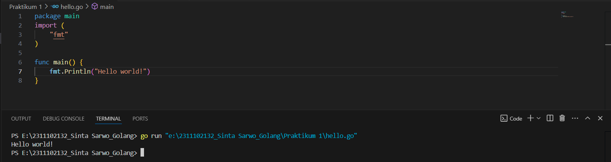

# <h1 align="center">Praktikum 1 Go - Hello World!</h1>
<p align="center">Sinta Sarwo - 2311102132</p>

## Program Code "Hello World!"

**1. Program Code**
```go
package main
import (
	"fmt"
)

func main() {
	fmt.Println("Hello world!")
}
```

**2. Screenshot Output**

#### Output:

