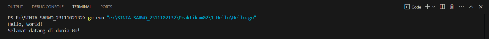
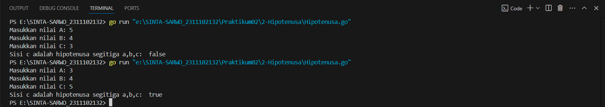
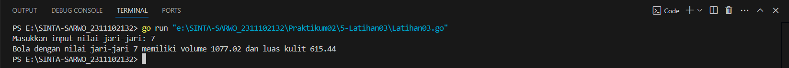
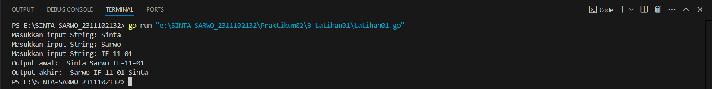
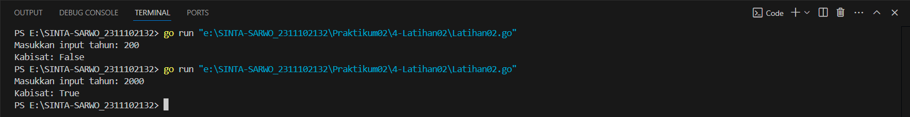
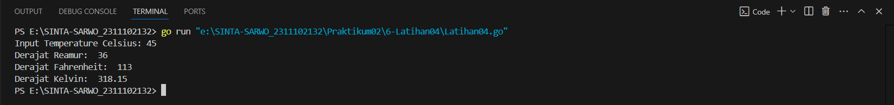
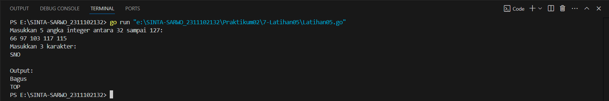

# <h1 align="center">Praktikum 2 Go - Modul 2 Review Struktur Kontrol</h1>
<p align="center">Sinta Sarwo - 2311102132</p>

## 1. Program Code "Hello"

**Program Code**
```go
//Setiap program dimulai dengan "package main"
package main

//Impor paket yang dibutuhkan, "fmt" berisi proses I/O standar
import (
	"fmt"
)

//Kode program utama dalam "fungsi main"
func main() {
	fmt.Println("Hello, World!")
	var greetings string = "Selamat datang di dunia Go!"
	var a, b int

	fmt.Println(greetings)
	fmt.Scanln(&a, &b)
	fmt.Printf("%v + %v = %v\n", a, b, a+b)
}
```

**Screenshot Output**

#### Output:


## 2. Program Code "Hipotenusa"

**Program Code**
```go
package main

import (
	"fmt"
)

func main() {
	var a, b, c float64
	var hipotenusa bool
	
	fmt.Print("Masukkan nilai A: ")
	fmt.Scanln(&a)
	fmt.Print("Masukkan nilai B: ")
	fmt.Scanln(&b)
	fmt.Print("Masukkan nilai C: ")
	fmt.Scanln(&c)
	hipotenusa = (c*c) == (a*a + b*b)
	fmt.Println( "Sisi c adalah hipotenusa segitiga a,b,c: ", hipotenusa)
}
```

**Screenshot Output**

#### Output:


## 3. Program Code Latihan 1"

**Program Code**
```go
//Sinta Sarow - 2311102132

package main

import (
	"fmt"
)

func main(){
	var (
		satu, dua, tiga string
		temp string
	)
	
	fmt.Print("Masukkan input String: ")
	fmt.Scanln(&satu)
	fmt.Print("Masukkan input String: ")
	fmt.Scanln(&dua)
	fmt.Print("Masukkan input String: ")
	fmt.Scanln(&tiga)
	fmt.Println("Output awal: ", satu + " " + dua + " " + tiga)
	temp = satu
	satu = dua
	dua = tiga
	tiga = temp
	fmt.Println("Output akhir: ", satu + " " + dua + " " + tiga)
}
```

**Screenshot Output**

#### Output:


## 4. Program Code Latihan 2

**Program Code**
```go
//Sinta Sarow - 2311102132

package main

import (
	"fmt"
)

func main(){
	var tahun int
	fmt.Print("Masukkan input tahun: ")
	fmt.Scanln(&tahun)

	if (tahun%400 == 0) || (tahun%4 == 0 && tahun%100 != 0){
		fmt.Println("Kabisat: True")
	}else {
		fmt.Println("Kabisat: False")
	}
}
```

**Screenshot Output**

#### Output:


## 5. Program Code Latihan 3

**Program Code**
```go
//Sinta Sarow - 2311102132

package main

import (
	"fmt"
)

func main(){
	var r, Volume_Bola, Luas_Bola float64
	var pi float64 = 3.14
	
	fmt.Print("Masukkan input nilai jari-jari: ")
	fmt.Scanln(&r)

	Luas_Bola = 4 * pi * r * r
	Volume_Bola = (4/3) * pi * r * r * r
	
	fmt.Println("Bola dengan nilai jari-jari", r, "memiliki volume", Volume_Bola, "dan luas kulit", Luas_Bola)
}
```

**Screenshot Output**

#### Output:


## 6. Program Code Latihan 4

**Program Code**
```go
//Sinta Sarow - 2311102132

package main

import (
	"fmt"
)

func main(){
	var Celsius, Fahrenheit, Reamur, Kelvin float64
	
	fmt.Print("Input Temperature Celsius: ")
	fmt.Scanln(&Celsius)

	Reamur = Celsius * 4 / 5
	Fahrenheit = (Celsius * 9 / 5)+32
	Kelvin = Celsius +  273.15
	
	fmt.Println("Derajat Reamur: ",Reamur)
	fmt.Println("Derajat Fahrenheit: ", Fahrenheit)
	fmt.Println("Derajat Kelvin: ", Kelvin)
}
```

**Screenshot Output**

#### Output:


## 7. Program Code Latihan 5

**Program Code**
```go
//Sinta Sarow - 2311102132

package main

import "fmt"

func main() {
	var a, b, c, d, e int
	var char string

	fmt.Println("Masukkan 5 angka integer antara 32 sampai 127: ")
	fmt.Scan(&a, &b, &c, &d, &e)
	
	fmt.Println("Masukkan 3 karakter:")
	fmt.Scan(&char)

	fmt.Println("")
	fmt.Println("Output:")
	
	fmt.Printf("%c%c%c%c%c\n", a, b, c, d, e)
	
	if len(char) == 3 {
		fmt.Printf("%c%c%c\n", char[0]+1, char[1]+1, char[2]+1)
	} else {
		fmt.Println("Error.")
	}
}
```

**Screenshot Output**

#### Output:

