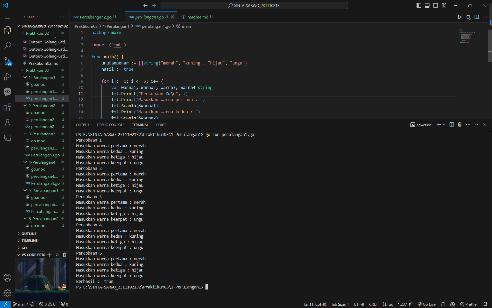
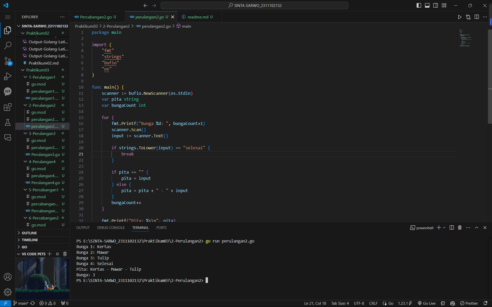
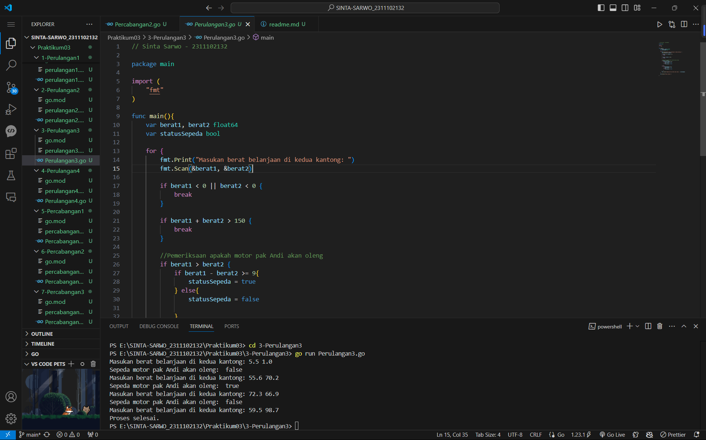
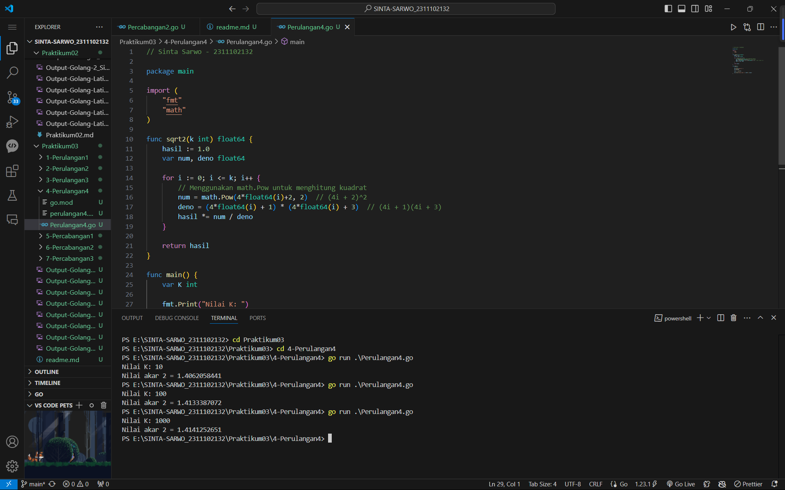
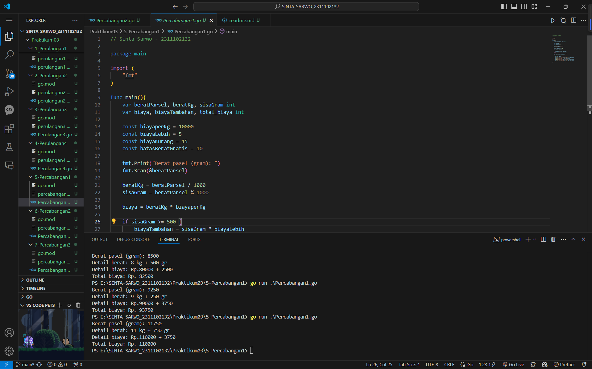
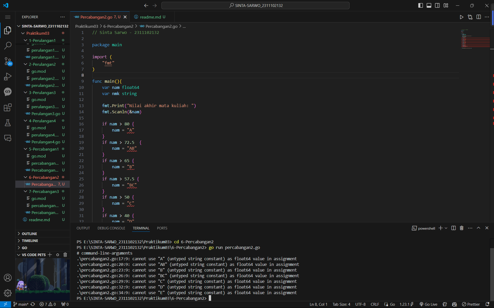
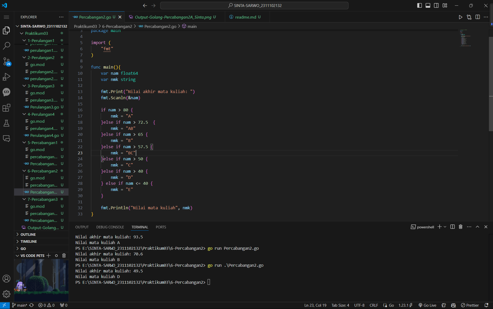
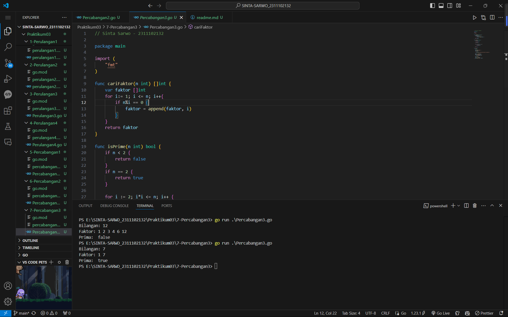

# <h1 align="center">Praktikum 2 Go - Modul 3 Perulangan & Percabangan</h1>
<p align="center">Sinta Sarwo - 2311102132</p>

## 1. Program Code Perulangan - 1

**Program Code**
```go
package main

import ("fmt")

func main() {
	urutanBenar := []string{"merah", "kuning", "hijau", "ungu"}
	hasil := true

	for i := 1; i <= 5; i++ {
		var warna1, warna2, warna3, warna4 string
		fmt.Printf("Percobaan %d\n", i)
		fmt.Print("Masukkan warna pertama : ")
		fmt.Scanln(&warna1)
		fmt.Print("Masukkan warna kedua : ")
		fmt.Scanln(&warna2)
		fmt.Print("Masukkan warna ketiga : ")
		fmt.Scanln(&warna3)
		fmt.Print("Masukkan warna keempat : ")
		fmt.Scanln(&warna4)	

		if warna1 != urutanBenar[0] || warna2 != urutanBenar[1] || warna3 != urutanBenar[2] || warna4 != urutanBenar[3] {
			hasil = false
		}
	}

	fmt.Println("Berhasil : ", hasil)
}
```

**Screenshot Output**

#### Output:

_Sinta.png)

## 2. Program Code Perulangan - 2

**Program Code**
```go
package main

import (
	"fmt"
	"strings"
	"bufio"
	"os"
)

func main() {
	scanner := bufio.NewScanner(os.Stdin)
	var pita string
	var bungaCount int

	for {
		fmt.Printf("Bunga %d: ", bungaCount+1)
		scanner.Scan()
		input := scanner.Text()

		if strings.ToLower(input) == "selesai" {
			break
		}

		if pita == "" {
			pita = input
		} else {
			pita = pita + " - " + input
		}
		bungaCount++
	}

	fmt.Printf("Pita: %s\n", pita)
	fmt.Printf("Bunga: %d\n", bungaCount)
}
```

**Screenshot Output**

#### Output:


## 3. Program Code Perulangan - 3

**Program Code**
```go
// Sinta Sarwo - 2311102132

package main

import (
	"fmt"
)

func main(){
	var berat1, berat2 float64
	var statusSepeda bool

	for {
		fmt.Print("Masukan berat belanjaan di kedua kantong: ")
		fmt.Scan(&berat1, &berat2)

		if berat1 < 0 || berat2 < 0 {
			break
		}

		if berat1 + berat2 > 150 {
			break
		}

		//Pemeriksaan apakah motor pak Andi akan oleng
		if berat1 > berat2 {
			if berat1 - berat2 >= 9{
				statusSepeda = true
			} else{
				statusSepeda = false

			}
		}else {
			if berat2-berat1 >= 9 {
				statusSepeda = true
			} else{
				statusSepeda = false

			}
		}
		fmt.Println("Sepeda motor pak Andi akan oleng: ", statusSepeda)
	}

	fmt.Println("Proses selesai.")

}
```

**Screenshot Output**

#### Output:


## 4. Program Code Perulangan - 4

**Program Code**
```go
// Sinta Sarwo - 2311102132

package main

import (
	"fmt"
	"math"
)

func sqrt2(k int) float64 {
	hasil := 1.0
	var num, deno float64

	for i := 0; i <= k; i++ {
		// Menggunakan math.Pow untuk menghitung kuadrat
		num = math.Pow(4*float64(i)+2, 2)  // (4i + 2)^2
		deno = (4*float64(i) + 1) * (4*float64(i) + 3)  // (4i + 1)(4i + 3)
		hasil *= num / deno
	}

	return hasil
}

func main() {
	var K int

	fmt.Print("Nilai K: ")
	fmt.Scan(&K)

	hasil := sqrt2(K)

	fmt.Printf("Nilai akar 2 = %.10f\n", hasil)
}
```

**Screenshot Output**

#### Output:


## 5. Program Code Percabangan - 1

**Program Code**
```go
// Sinta Sarwo - 2311102132

package main

import (
	"fmt"
)

func main(){
	var beratParsel, beratKg, sisaGram int
	var biaya, biayaTambahan, total_biaya int

	const biayaperKg = 10000
	const biayaLebih = 5
	const biayaKurang = 15
	const batasBeratGratis = 10
	
	fmt.Print("Berat pasel (gram): ")
	fmt.Scan(&beratParsel)

	beratKg = beratParsel / 1000
	sisaGram = beratParsel % 1000

	biaya = beratKg * biayaperKg

	if sisaGram >= 500 {
		biayaTambahan = sisaGram * biayaLebih
	} else {
		biayaTambahan = sisaGram * biayaKurang
	}

	total_biaya = biaya + biayaTambahan
	
	if beratKg > 10 {
		total_biaya = biaya
		fmt.Printf("Detail berat: %d kg + %d gr\n", beratKg, sisaGram)
		fmt.Printf("Detail biaya: Rp.%d + %d\n", biaya, biayaTambahan)
		fmt.Printf("Total biaya: Rp. %d\n", total_biaya)	
	} else {
		fmt.Printf("Detail berat: %d kg + %d gr\n", beratKg, sisaGram)
		fmt.Printf("Detail biaya: Rp.%d + %d\n", biaya, biayaTambahan)
		fmt.Printf("Total biaya: Rp. %d\n", total_biaya)
	}
}
```

**Screenshot Output**

#### Output:


## 6. Program Code Percabangan - 2

**Program Code Sebelum**
```go
// Sinta Sarwo - 2311102132

package main

import (
	"fmt"
)

func main(){
	var nam float64
	var nmk string

	fmt.Print("Nilai akhir mata kuliah: ")
	fmt.Scanln(&nam)

	if nam > 80 {
		nam = "A"
	}
	if nam > 72.5  {
		nam = "AB"
	}
	if nam > 65 {
		nam = "B"
	}
	if nam > 57.5 {
		nam = "BC"
	}
	if nam > 50 {
		nam = "C"
	}
	if nam > 40 {
		nam = "D"
	} else if nam <= 40 {
		nam = "E"
	}

	fmt.Println("Nilai mata kuliah", nmk)
}
```

**Screenshot Output**

#### Output Sebelum Perbaikan Program:


##### Jawablah Pertanyaan-pertanyaan berikut:
1. Jika **nam** adaah 80.1, apa keluaran dari program tersebut? Apakah eksekusi program tersebut sesuai spesifikasi soal?
- Jawaban: <br/>

Dari screenshot di atas output dari program tidak sesuai spesifikasi soal. Meskipun program saat di run tidak error, tetapi saat mencetak variabel nmk tidak akan menunjukkan nilai yang karena belum menyimpan data apapun.


2. Apa saja kesalahan dari program tersebut? Mengapa demikian? Jelaskan alur program seharusnya!
- Jawaban: <br/>
Kesalahan dari program tersebut terhadap pengunaan variabel, di dalam program nam menjadi menyimpan tipe data string sedangkan ia di deklarasikan sebagai variabel yang menyimpan tipe data float64. Karena itu variabel nmk tidak digunakan hanya di cetak yang saat dicetak tidak memiliki nilai.Pengunaan percabangaan yang kurang efektif, dalam program dapat menggunakan if, else if, else untuk setiap pemeriksaan nilai. <br/>

Alur program seharusnya:<br/>
1. input nilai akhir -> nam
2. menentukan nilai huruf berdasarkan nilai numerik menggunakan struktur if, else if, dan else.
3. nmk <- '(Nilai huruf)', nmk menyimpan data string
4. menampilkan output yang benar, yaitu nilai huruf.


3. Perbaiki program tersebut! Ujilah dengan masukan: 93.5; 70.6; dan 49.5. Seharusnya keluaran yang diperoleh adalah 'A', 'B', dan 'D'. <br/>
- Jawaban:

**Program Code Setelah**
```go
// Sinta Sarwo - 2311102132

package main

import (
	"fmt"
)

func main(){
	var nam float64
	var nmk string

	fmt.Print("Nilai akhir mata kuliah: ")
	fmt.Scanln(&nam)

	if nam > 80 {
		nmk = "A"
	}else if nam > 72.5  {
		nmk = "AB"
	}else if nam > 65 {
		nmk = "B"
	}else if nam > 57.5 {
		nmk = "BC"
	}else if nam > 50 {
		nmk = "C"
	}else if nam > 40 {
		nmk = "D"
	} else if nam <= 40 {
		nmk = "E"
	}

	fmt.Println("Nilai mata kuliah", nmk)
}
```
#### Output Uji:


## 7. Program Code Percabangan - 3

**Program Code**
```go
// Sinta Sarwo - 2311102132

package main

import (
	"fmt"
)

func cariFaktor(n int) []int {
	var faktor []int
	for i:= 1; i <= n; i++{
		if n%i == 0 {
			faktor = append(faktor, i)
		}
	}
	return faktor
}

func isPrime(n int) bool {
	if n < 2 {
		return false
	}
	if n == 2 {
		return true
	}

	for i := 2; i*i <= n; i++ {
		if n%i == 0{
			return false
		}
	}
	return true
}

func main(){
	var b int

	fmt.Print("Bilangan: ")
	fmt.Scan(&b)

	if b <= 0 {
		fmt.Println("Bilangan tidak boleh 0 atau negatif.")
	}

	faktor := cariFaktor(b)
	fmt.Print("Faktor: ")
	for _, f := range faktor {
		fmt.Printf("%d ", f)
	}
	fmt.Println()

	prima := isPrime(b)
	fmt.Println("Prima: ",prima )
}
```

**Screenshot Output**

#### Output:

