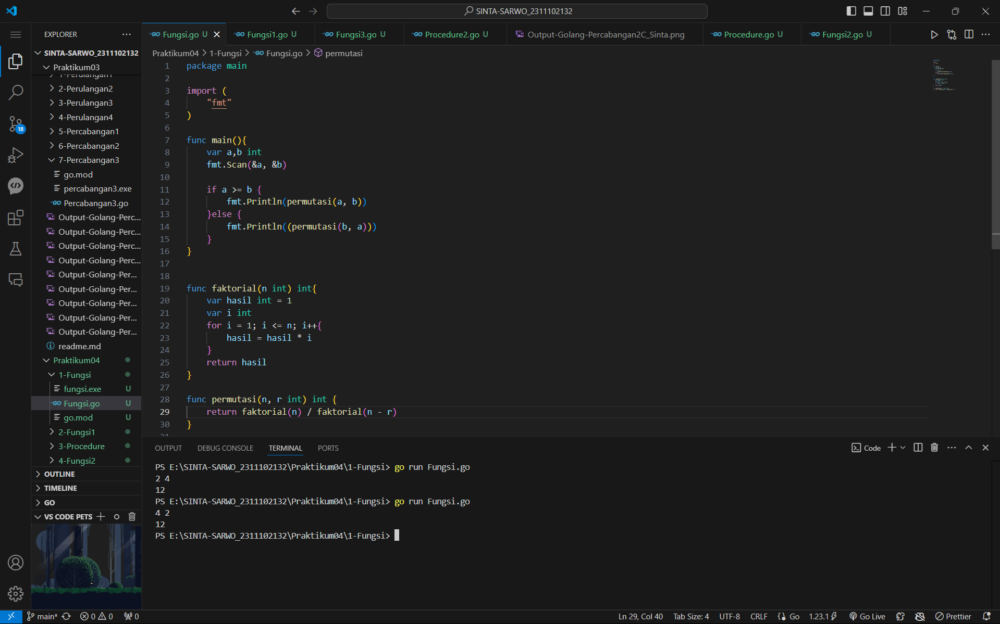
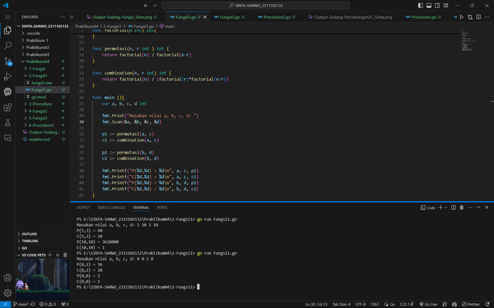
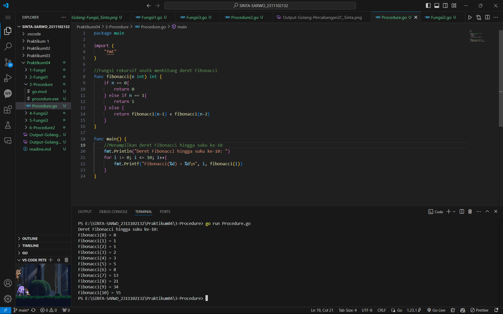
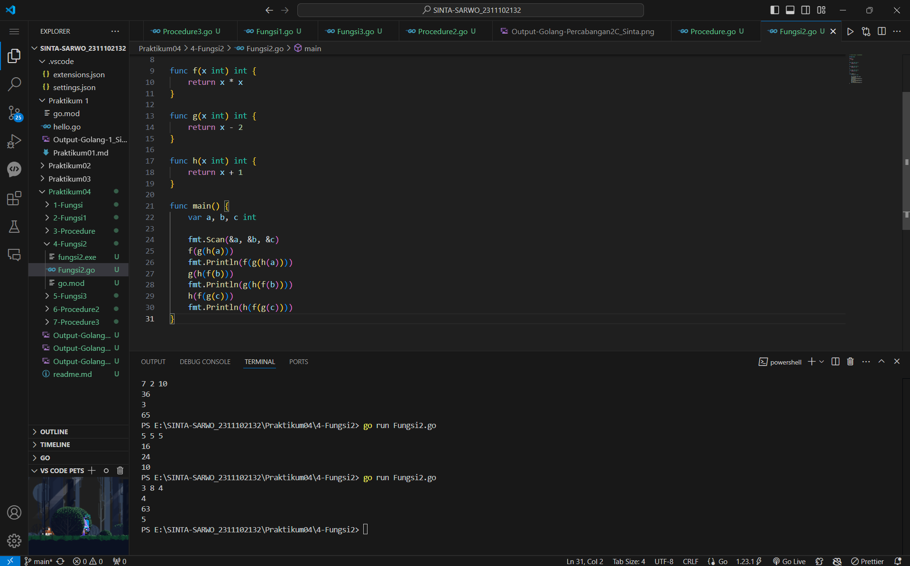
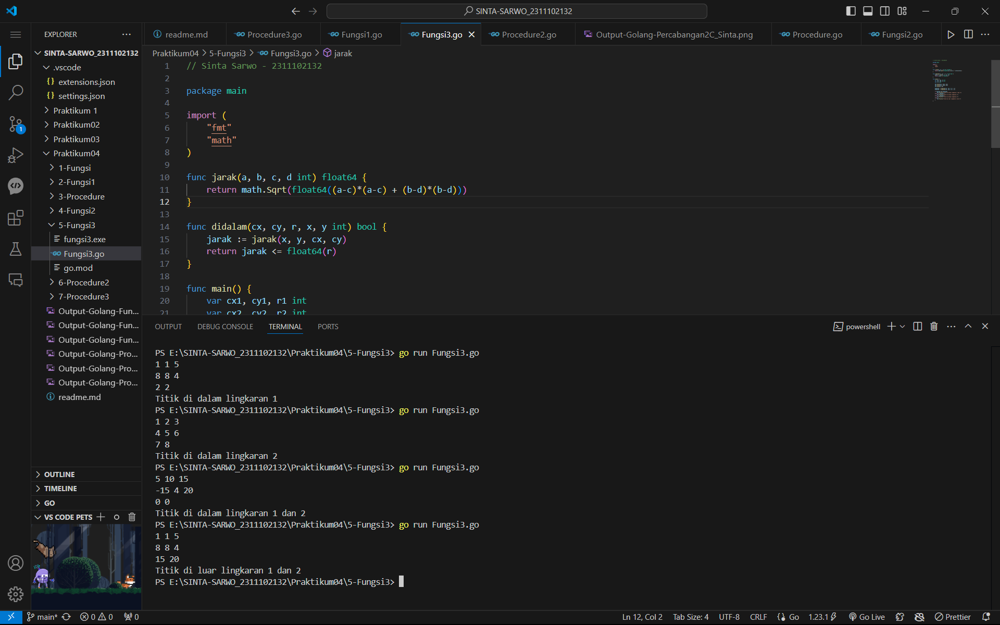
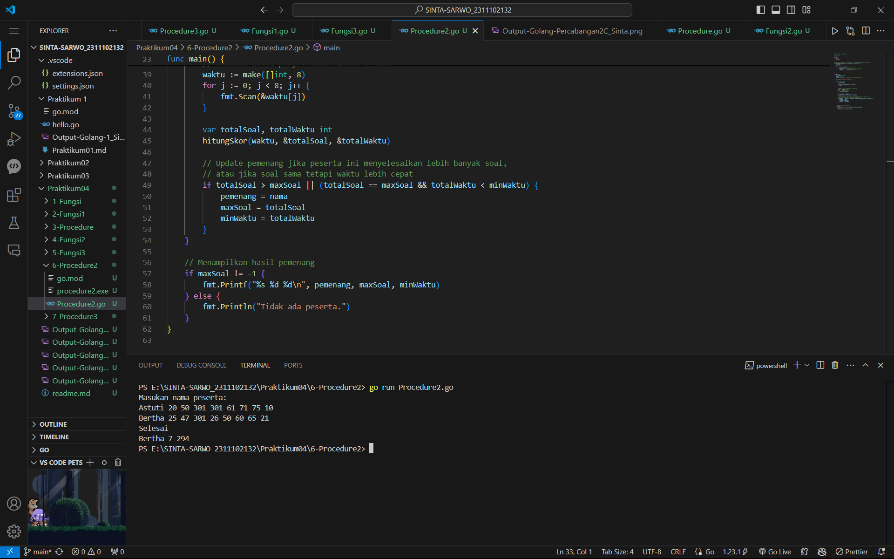
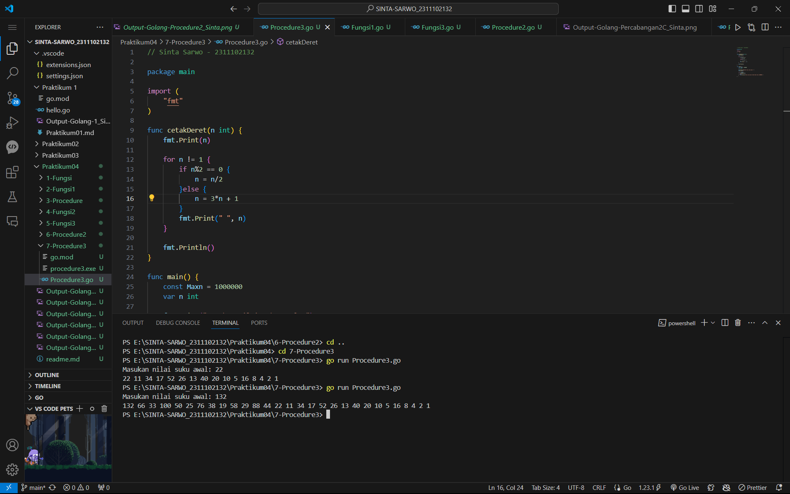

# <h1 align="center">Praktikum 4 Go - Modul 3 & 4, Fungsi dan Procedure</h1>
<p align="center">Sinta Sarwo - 2311102132</p>

## 1. Program Code Fungsi

**Program Code**
```go
package main

import (
	"fmt"
)

func main(){
	var a,b int
	fmt.Scan(&a, &b)

	if a >= b {
		fmt.Println(permutasi(a, b))
	}else {
		fmt.Println((permutasi(b, a)))
	}
}


func faktorial(n int) int{
	var hasil int = 1
	var i int
	for i = 1; i <= n; i++{
		hasil = hasil * i
	}
	return hasil
}

func permutasi(n, r int) int {
	return faktorial(n) / faktorial(n - r)
}
```

**Screenshot Output**

#### Output:


## 2. Program Code Fungsi - Latihan 1

**Program Code**
```go
package main

import (
	"fmt"
)

func factorial(n int) int{
	if n == 0  || n == 1 {
		return 1
	}
	result := 1
	for i := 2; i <= n; i++{
		result *= i
	}
	return result
}

func permutasi(n, r int ) int {
	return factorial(n) / factorial(n-r)
}

func combination(n, r int) int {
	return factorial(n) / (factorial(r)*factorial(n-r))
}

func main (){
	var a, b, c, d int

	fmt.Print("Masukan nilai a, b, c, d: ")
	fmt.Scan(&a, &b, &c, &d)

	p1 := permutasi(a, c)
	c1 := combination(a, c)

	p2 := permutasi(b, d)
	c2 := combination(b, d)

	fmt.Printf("P(%d,%d) = %d\n", a, c, p1)
	fmt.Printf("C(%d,%d) = %d\n", a, c, c1)
	fmt.Printf("P(%d,%d) = %d\n", b, d, p2)
	fmt.Printf("C(%d,%d) = %d\n", b, d, c2)
}
```

**Screenshot Output**

#### Output:


## 3. Program Code Procedure

**Program Code**
```go
package main

import (
	"fmt"
)

//Fungsi rekursif unutk menhitung deret Fibonacci
func fibonacci(n int) int {
	if n == 0{
		return 0
	} else if n == 1{
		return 1
	} else {
		return fibonacci(n-1) + fibonacci(n-2)
	}
}

func main() {
	//Menampilkan deret Fibonacci hingga suku ke-10
	fmt.Println("Deret Fibonacci hingga suku ke-10: ")
	for i := 0; i <= 10; i++{
		fmt.Printf("Fibonacci(%d) = %d\n", i, fibonacci(i))
	}
}
```

**Screenshot Output**

#### Output:


## 4. Program Code Fungsi - Latihan 2

**Program Code**
```go
/// Sinta Sarwo - 2311102132

package main

import (
	"fmt"
)

func f(x int) int {
	return x * x
} 

func g(x int) int {
	return x - 2
}

func h(x int) int {
	return x + 1
}

func main() {
	var a, b, c int

	fmt.Scan(&a, &b, &c)
	f(g(h(a)))
	fmt.Println(f(g(h(a))))
	g(h(f(b)))
	fmt.Println(g(h(f(b))))
	h(f(g(c)))
	fmt.Println(h(f(g(c))))
}
```

**Screenshot Output**

#### Output:


## 5. Program Code Fungsi - Latihan 3

**Program Code**
```go
// Sinta Sarwo - 2311102132

package main

import (
	"fmt"
	"math"
)

func jarak(a, b, c, d int) float64 {
	return math.Sqrt(float64((a-c)*(a-c) + (b-d)*(b-d)))
}

func didalam(cx, cy, r, x, y int) bool {
	jarak := jarak(x, y, cx, cy)
	return jarak <= float64(r)
}

func main() {
	var cx1, cy1, r1 int
	var cx2, cy2, r2 int
	var x, y int

	fmt.Scan(&cx1, &cy1, &r1)
	fmt.Scan(&cx2, &cy2, &r2)
	fmt.Scan(&x, &y)

	didalam1 := didalam(cx1, cy1, r1, x, y)
	didalam2 := didalam(cx2, cy2, r2, x, y)

	if didalam1 && didalam2{
		fmt.Println("Titik di dalam lingkaran 1 dan 2")
	}else if didalam1 {
		fmt.Println("Titik di dalam lingkaran 1")
	}else if didalam2 {
		fmt.Println("Titik di dalam lingkaran 2")
	}else {
		fmt.Println("Titik di luar lingkaran 1 dan 2")
	}
}
```

**Screenshot Output**

#### Output:


## 6. Program Code Procedure - Latihan 2

**Program Code**
```go
// Sinta Sarwo - 2311102132

package main

import (
	"fmt"
	"strings"
)

// Prosedur hitungSkor untuk menghitung soal yang diselesaikan dan total waktu
func hitungSkor(waktu []int, totalSoal *int, skor *int) {
	*totalSoal = 0
	*skor = 0

	for _, w := range waktu {
		if w < 301 { // Batas waktu 301 menit
			*totalSoal++ // Menambah soal yang diselesaikan
			*skor += w   // Menambah total waktu
		}
	}
}

func main() {
	var pemenang string
	maxSoal := -1
	minWaktu := 99999 // Nilai awal untuk perbandingan waktu

	fmt.Println("Masukan nama peserta:")

	for {
		var nama string
		fmt.Scan(&nama)

		if strings.ToLower(nama) == "selesai" {
			break
		}

		// Membaca waktu penyelesaian untuk 8 soal
		waktu := make([]int, 8)
		for j := 0; j < 8; j++ {
			fmt.Scan(&waktu[j])
		}

		var totalSoal, totalWaktu int
		hitungSkor(waktu, &totalSoal, &totalWaktu)

		// Update pemenang jika peserta ini menyelesaikan lebih banyak soal,
		// atau jika soal sama tetapi waktu lebih cepat
		if totalSoal > maxSoal || (totalSoal == maxSoal && totalWaktu < minWaktu) {
			pemenang = nama
			maxSoal = totalSoal
			minWaktu = totalWaktu
		}
	}

	// Menampilkan hasil pemenang
	if maxSoal != -1 {
		fmt.Printf("%s %d %d\n", pemenang, maxSoal, minWaktu)
	} else {
		fmt.Println("Tidak ada peserta.")
	}
}
```

**Screenshot Output**

#### Output Sebelum Perbaikan Program:


## 7. Program Code Procedure - Latihan 3

**Program Code**
```go
// Sinta Sarwo - 2311102132

package main

import (
	"fmt"
)

func cetakDeret(n int) {
	fmt.Print(n)

	for n != 1 {
		if n%2 == 0 {
			n = n/2
		}else {
			n = 3*n + 1
		}
		fmt.Print(" ", n)
	}

	fmt.Println()
}

func main() {
	const Maxn = 1000000
	var n int

	fmt.Print("Masukan nilai suku awal: ")
	fmt.Scan(&n)

	if n < Maxn {
		cetakDeret(n)
	} else {
		fmt.Println("Nilai suku awal lebih besar dari 1000000.")
	}
}
```

**Screenshot Output**

#### Output:

