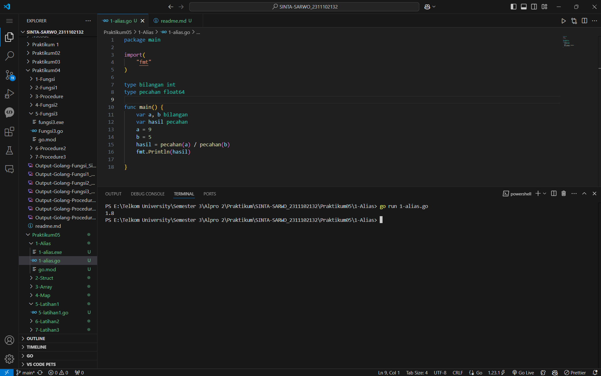
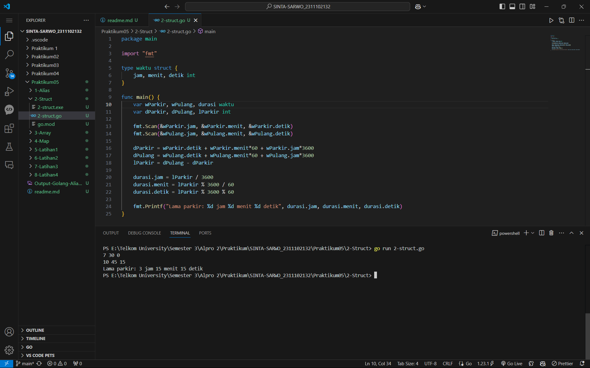
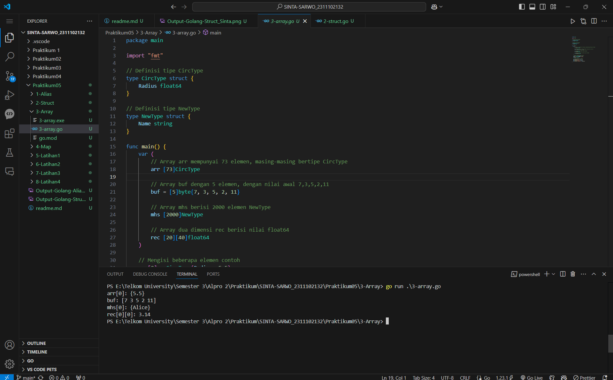
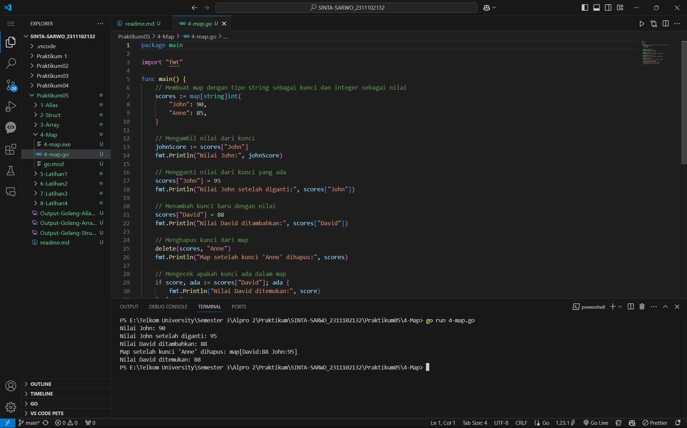
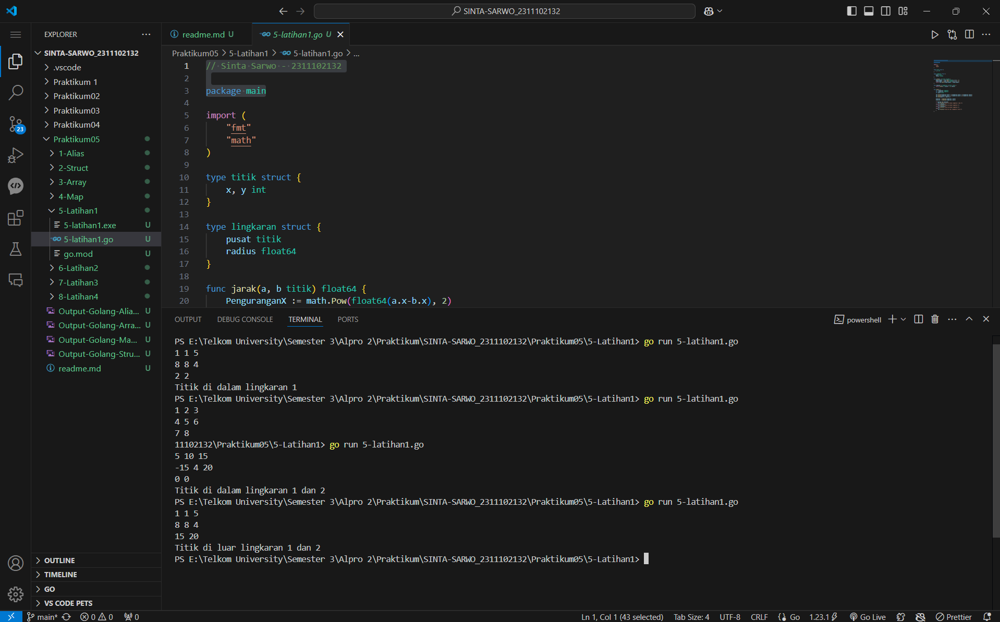
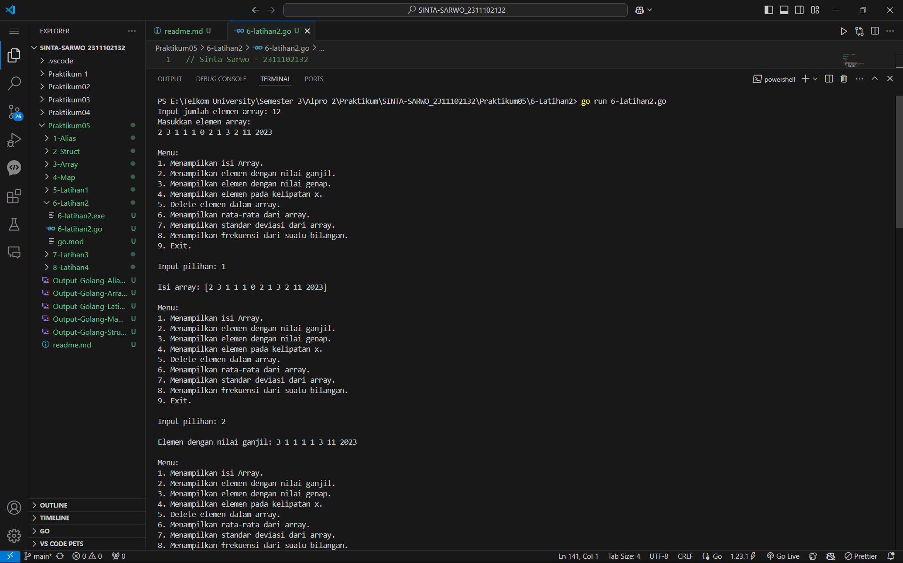
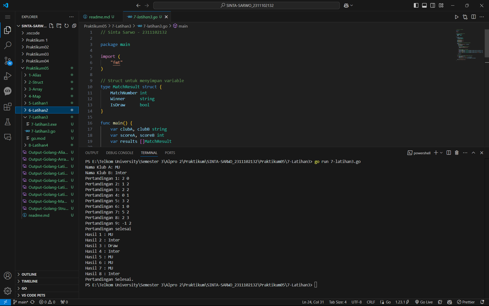
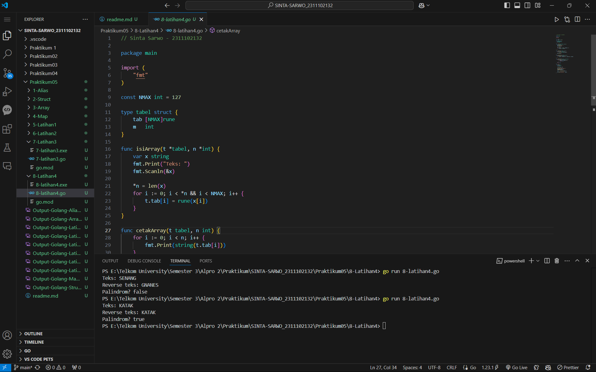

# <h1 align="center">Praktikum 5 Go - Modul 7 Struct & Array</h1>
<p align="center">Sinta Sarwo - 2311102132</p>

## 1. Program Code - Alias

**Program Code**
```go
package main

import(
	"fmt"
)

type bilangan int
type pecahan float64

func main() {
	var a, b bilangan
	var hasil pecahan
	a = 9
	b = 5
	hasil = pecahan(a) / pecahan(b)
	fmt.Println(hasil)

}
```

**Screenshot Output**

#### Output:


## 2. Program Code - Struct

**Program Code**
```go
package main

import "fmt"

type waktu struct {
	jam, menit, detik int
}

func main() {
	var wParkir, wPulang, durasi waktu
	var dParkir, dPulang, lParkir int

	fmt.Scan(&wParkir.jam, &wParkir.menit, &wParkir.detik)
	fmt.Scan(&wPulang.jam, &wPulang.menit, &wPulang.detik)

	dParkir = wParkir.detik + wParkir.menit*60 + wParkir.jam*3600
	dPulang = wPulang.detik + wPulang.menit*60 + wPulang.jam*3600
	lParkir = dPulang - dParkir

	durasi.jam = lParkir / 3600
	durasi.menit = lParkir % 3600 / 60
	durasi.detik = lParkir % 3600 % 60
	
	fmt.Printf("Lama parkir: %d jam %d menit %d detik", durasi.jam, durasi.menit, durasi.detik)
}
```

**Screenshot Output**

#### Output:


## 3. Program Code - Array

**Program Code**
```go
package main

import "fmt"

// Definisi tipe CircType
type CircType struct {
	Radius float64
}

// Definisi tipe NewType
type NewType struct {
	Name string
}

func main() {
	var (
		// Array arr mempunyai 73 elemen, masing-masing bertipe CircType
		arr [73]CircType

		// Array buf dengan 5 elemen, dengan nilai awal 7,3,5,2,11
		buf = [5]byte{7, 3, 5, 2, 11}

		// Array mhs berisi 2000 elemen NewType
		mhs [2000]NewType

		// Array dua dimensi rec berisi nilai float64
		rec [20][40]float64
	)

	// Mengisi beberapa elemen contoh
	arr[0] = CircType{Radius: 5.5}
	mhs[0] = NewType{Name: "Alice"}
	rec[0][0] = 3.14

	// Contoh penggunaan variabel
	fmt.Println("arr[0]:", arr[0])
	fmt.Println("buf:", buf)
	fmt.Println("mhs[0]:", mhs[0])
	fmt.Println("rec[0][0]:", rec[0][0])
}
```

**Screenshot Output**

#### Output:


## 4. Program Code - Map

**Program Code**
```go
package main

import "fmt"

func main() {
	// Membuat map dengan tipe string sebagai kunci dan integer sebagai nilai
	scores := map[string]int{
		"John": 90,
		"Anne": 85,
	}

	// Mengambil nilai dari kunci
	johnScore := scores["John"]
	fmt.Println("Nilai John:", johnScore)

	// Mengganti nilai dari kunci yang ada
	scores["John"] = 95
	fmt.Println("Nilai John setelah diganti:", scores["John"])

	// Menambah kunci baru dengan nilai
	scores["David"] = 88
	fmt.Println("Nilai David ditambahkan:", scores["David"])

	// Menghapus kunci dari map
	delete(scores, "Anne")
	fmt.Println("Map setelah kunci 'Anne' dihapus:", scores)

	// Mengecek apakah kunci ada dalam map
	if score, ada := scores["David"]; ada {
		fmt.Println("Nilai David ditemukan:", score)
	} else {
		fmt.Println("Nilai David tidak ditemukan")
	}
}
```

**Screenshot Output**

#### Output:


## 5. Program Code Struct - Latihan 1

**Program Code**
```go
// Sinta Sarwo - 2311102132

package main

import (
	"fmt"
	"math"
)

type titik struct {
	x, y int
}

type lingkaran struct {
	pusat titik
	radius float64
}

func jarak(a, b titik) float64 {
	PenguranganX := math.Pow(float64(a.x-b.x), 2)
	PenguranganY := math.Pow(float64(a.y-b.y), 2)
	return math.Sqrt(PenguranganX + PenguranganY)
}

func didalam (c lingkaran, a titik ) bool {
	return jarak(a, c.pusat) < (c.radius)
}

func main() {
	var lingkaran1 lingkaran
	var lingkaran2 lingkaran
	var point titik

	fmt.Scan(&lingkaran1.pusat.x, &lingkaran1.pusat.y, &lingkaran1.radius)
	fmt.Scan(&lingkaran2.pusat.x, &lingkaran2.pusat.y, &lingkaran2.radius)
	fmt.Scan(&point.x, &point.y)

	didalam1 := didalam(lingkaran1, point)
	didalam2 := didalam(lingkaran2, point)

	if didalam1 && didalam2{
		fmt.Println("Titik di dalam lingkaran 1 dan 2")
	}else if didalam1 {
		fmt.Println("Titik di dalam lingkaran 1")
	}else if didalam2 {
		fmt.Println("Titik di dalam lingkaran 2")
	}else {
		fmt.Println("Titik di luar lingkaran 1 dan 2")
	}
}
```

**Screenshot Output**

#### Output:


## 6. Program Code Array - Latihan 2

**Program Code**
```go
// Sinta Sarwo - 2311102132

package main

import (
	"fmt"
	"math"
)

func indeksGanjil(arr []int) {
	fmt.Print("Elemen dengan nilai ganjil: ")
	for _, hasil := range arr {
		if hasil%2 != 0 {
			fmt.Print(hasil, " ")
		}
	}
	fmt.Println()
}

func indeksGenap(arr []int) {
	fmt.Print("Elemen dengan nilai genap: ")
	for _, hasil := range arr {
		if hasil%2 == 0 && hasil != 0 {
			fmt.Print(hasil, " ")
		}
	}
	fmt.Println()
}

func Kelipatan(arr []int, x int) {
	fmt.Printf("Elemen pada indeks kelipatan %d: ", x)
	for i := x - 1; i < len(arr); i += x {
		if arr[i] != 0 {
			fmt.Print(arr[i], " ")
		}
	}
	fmt.Println()
}

func Delete(arr []int, delx int) []int {
	if delx >= 0 && delx < len(arr) {
		return append(arr[:delx], arr[delx+1:]...)
	}
	fmt.Println("Indeks tidak valid untuk penghapusan.")
	return arr
}

func mean(arr []int) int {
	sum := 0
	for _, hasil := range arr {
		sum += hasil
	}
	return sum / len(arr)
}

func StandarDeviasi(arr []int, rataRata float64) float64 {
	var variasiSum float64
	for _, hasil := range arr {
		variasiSum += math.Pow(float64(hasil)-rataRata, 2)
	}
	return math.Sqrt(variasiSum / float64(len(arr)))
}

func Frekuensi(arr []int, target int) int {
	frekuensi := 0
	for _, hasil := range arr {
		if hasil == target {
			frekuensi++
		}
	}
	return frekuensi
}

func main() {
	var N, x, delx, target, pilihan int

	fmt.Print("Input jumlah elemen array: ")
	fmt.Scan(&N)

	Array := make([]int, N)
	fmt.Println("Masukkan elemen array: ")
	for i := 0; i < N; i++ {
		fmt.Scan(&Array[i])
	}
	fmt.Println()

	for {
		fmt.Println("Menu:")
		fmt.Println("1. Menampilkan isi Array.")
		fmt.Println("2. Menampilkan elemen dengan nilai ganjil.")
		fmt.Println("3. Menampilkan elemen dengan nilai genap.")
		fmt.Println("4. Menampilkan elemen pada kelipatan x.")
		fmt.Println("5. Delete elemen dalam array.")
		fmt.Println("6. Menampilkan rata-rata dari array.")
		fmt.Println("7. Menampilkan standar deviasi dari array.")
		fmt.Println("8. Menampilkan frekuensi dari suatu bilangan.")
		fmt.Println("9. Exit.")
		fmt.Print("\nInput pilihan: ")
		fmt.Scan(&pilihan)
		fmt.Println()

		switch pilihan {
		case 1:
			fmt.Println("Isi array:", Array)
			fmt.Println()
		case 2:
			indeksGanjil(Array)
			fmt.Println()
		case 3:
			indeksGenap(Array)
			fmt.Println()
		case 4:
			fmt.Print("Input kelipatan: ")
			fmt.Scan(&x)
			Kelipatan(Array, x)
		case 5:
			fmt.Print("Input indeks elemen yang ingin dihapus: ")
			fmt.Scan(&delx)
			Array = Delete(Array, delx)
			fmt.Println("Array setelah dihapus:", Array)
			fmt.Println()
		case 6:
			fmt.Println("Rata-rata array:", mean(Array))
			fmt.Println()
		case 7:
			fmt.Println("Standar deviasi array:", StandarDeviasi(Array, float64(mean(Array))))
			fmt.Println()
		case 8:
			fmt.Print("Input bilangan target: ")
			fmt.Scan(&target)
			fmt.Printf("Frekuensi %d dalam array: %d\n", target, Frekuensi(Array, target))
			fmt.Println()
		case 9:
			fmt.Println("End Program ;)")
			return
		default:
			fmt.Println("Command Invalid!")
		}
	}
}
```

**Screenshot Output**

#### Output Sebelum Perbaikan Program:

_Sinta.png)
_Sinta.png)
_Sinta.png)


## 7. Program Code Struct - Latihan 3

**Program Code**
```go
// Sinta Sarwo - 2311102132

package main

import (
	"fmt"
)

// Struct untuk menyimpan variable
type MatchResult struct {
	MatchNumber int
	Winner      string
	IsDraw      bool
}

func main() {
	var clubA, clubB string
	var scoreA, scoreB int
	var results []MatchResult

	// Input nama club 
	fmt.Print("Nama Klub A: ")
	fmt.Scanln(&clubA)
	fmt.Print("Nama Klub B: ")
	fmt.Scanln(&clubB)

	// Proses menentukan hasil pertandingan dan meyimpan
	matchCount := 1
	for {
		fmt.Printf("Pertandingan %d: ", matchCount)
		fmt.Scan(&scoreA)
		fmt.Scan(&scoreB)

		// Program behenti jika score kurang dari 0
		if scoreA < 0 || scoreB < 0 {
			fmt.Println("Pertandingan selesai")
			break
		}

		// Penentuan Pemenang dari pertandingan
		if scoreA > scoreB {
			results = append(results, MatchResult{MatchNumber: matchCount, Winner: clubA, IsDraw: false})
		} else if scoreB > scoreA {
			results = append(results, MatchResult{MatchNumber: matchCount, Winner: clubB, IsDraw: false})
		} else {
			results = append(results, MatchResult{MatchNumber: matchCount, Winner: "Draw", IsDraw: true})
		}

		matchCount++
	}

	// Menampilkan hasil dari semua pertandingan setelah selesai
	for _, result := range results {
		if result.IsDraw {
			fmt.Printf("Hasil %d : Draw\n", result.MatchNumber)
		} else {
			fmt.Printf("Hasil %d : %s \n", result.MatchNumber, result.Winner)
		}
	}
	fmt.Print("Pertandingan Selesai.")

}
```

**Screenshot Output**

#### Output:


## 8. Program Code Array - Latihan 4

**Program Code**
```go
// Sinta Sarwo - 2311102132

package main

import (
    "fmt"
)

const NMAX int = 127

type tabel struct {
    tab [NMAX]rune
    m   int
}

func isiArray(t *tabel, n *int) {
    var x string
    fmt.Print("Teks: ")
    fmt.Scanln(&x)

    *n = len(x)
    for i := 0; i < *n && i < NMAX; i++ {
        t.tab[i] = rune(x[i])
    }
}

func cetakArray(t tabel, n int) {
    for i := 0; i < n; i++ {
        fmt.Print(string(t.tab[i]))
    }
    fmt.Println()
}

func balikanArray(t *tabel, n int) {
    for i := 0; i < n/2; i++ {
        t.tab[i], t.tab[n-i-1] = t.tab[n-i-1], t.tab[i]
    }
}

func isPalindrome(t tabel, n int) bool {
    for i := 0; i < n/2; i++ {
        if t.tab[i] != t.tab[n-i-1] {
            return false
        }
    }
    return true
}

func main() {
    var tab tabel
    var m int

    isiArray(&tab, &m)

    fmt.Print("Reverse teks: ")
    balikanArray(&tab, m)
    cetakArray(tab, m)

    hasil := isPalindrome(tab, m)

    fmt.Print("Palindrom? ", hasil)
}
```

**Screenshot Output**

#### Output:

