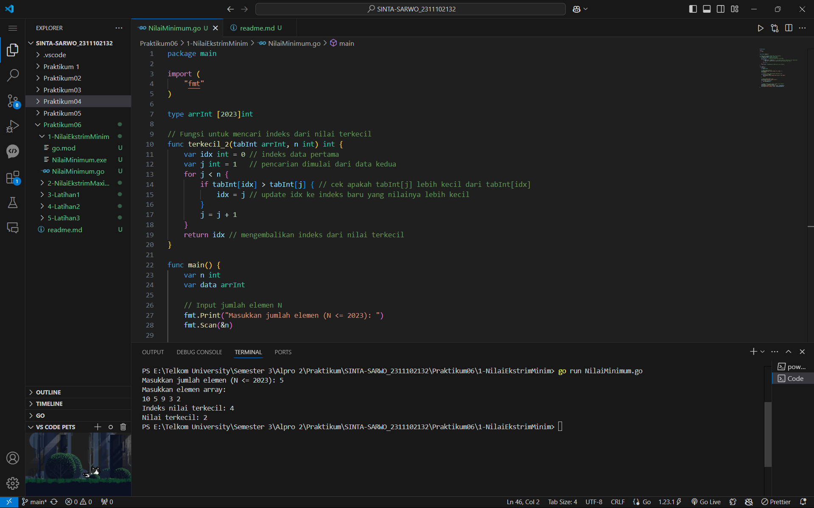
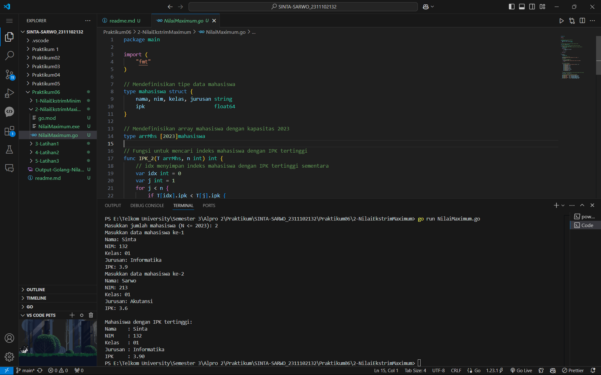
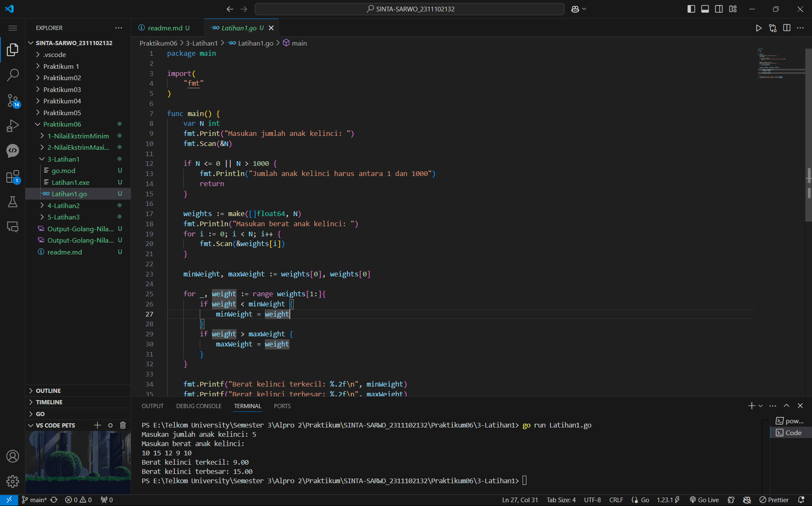
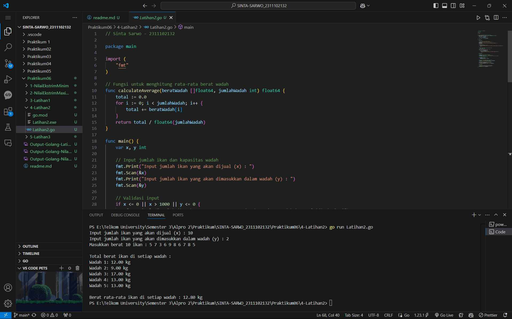
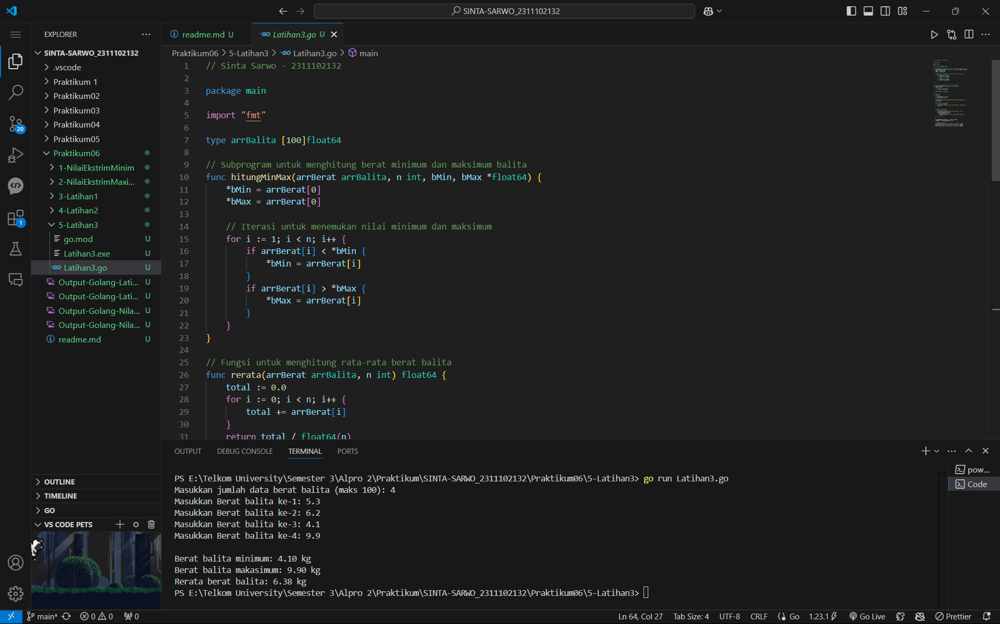

# <h1 align="center">Praktikum 6 Go - Modul 10. Pencarian Nilai Ekstrim pada Himpunan Data</h1>
<p align="center">Sinta Sarwo - 2311102132</p>

## 1. Program Code - Nilai Ekstrim Minumum

**Program Code**
```go
package main

import (
	"fmt"
)

type arrInt [2023]int

// Fungsi untuk mencari indeks dari nilai terkecil
func terkecil_2(tabInt arrInt, n int) int {
	var idx int = 0 // indeks data pertama
	var j int = 1   // pencarian dimulai dari data kedua
	for j < n {
		if tabInt[idx] > tabInt[j] { // cek apakah tabInt[j] lebih kecil dari tabInt[idx]
			idx = j // update idx ke indeks baru yang nilainya lebih kecil
		}
		j = j + 1
	}
	return idx // mengembalikan indeks dari nilai terkecil
}

func main() {
	var n int
	var data arrInt

	// Input jumlah elemen N
	fmt.Print("Masukkan jumlah elemen (N <= 2023): ")
	fmt.Scan(&n)

	// Validasi N agar tidak melebihi kapasitas array
	if n <= 0 || n > 2023 {
		fmt.Println("Jumlah elemen harus antara 1 dan 2023")
		return
	}

	// Input elemen-elemen array
	fmt.Println("Masukkan elemen array:")
	for i := 0; i < n; i++ {
		fmt.Scan(&data[i])
	}

	// Panggil fungsi untuk mencari indeks nilai terkecil
	idxTerkecil := terkecil_2(data, n)
	fmt.Printf("Indeks nilai terkecil: %d\n", idxTerkecil)
	fmt.Printf("Nilai terkecil: %d\n", data[idxTerkecil])
}
```

**Screenshot Output**

#### Output:


## 2. Program Code - Nilai Ektrim Minimum

**Program Code**
```go
package main

import (
	"fmt"
)

// Mendefinisikan tipe data mahasiswa
type mahasiswa struct {
	nama, nim, kelas, jurusan string
	ipk                       float64
}

// Mendefinisikan array mahasiswa dengan kapasitas 2023
type arrMhs [2023]mahasiswa

// Fungsi untuk mencari indeks mahasiswa dengan IPK tertinggi
func IPK_2(T arrMhs, n int) int {
	// idx menyimpan indeks mahasiswa dengan IPK tertinggi sementara
	var idx int = 0
	var j int = 1
	for j < n {
		if T[idx].ipk < T[j].ipk {
			idx = j
		}
		j = j + 1
	}
	return idx
}

func main() {
	var n int
	var data arrMhs

	// Input jumlah mahasiswa
	fmt.Print("Masukkan jumlah mahasiswa (N <= 2023): ")
	fmt.Scan(&n)

	// Validasi jumlah mahasiswa
	if n <= 0 || n > 2023 {
		fmt.Println("Jumlah mahasiswa harus antara 1 dan 2023")
		return
	}

	// Input data mahasiswa
	for i := 0; i < n; i++ {
		fmt.Printf("Masukkan data mahasiswa ke-%d\n", i+1)
		fmt.Print("Nama: ")
		fmt.Scan(&data[i].nama)
		fmt.Print("NIM: ")
		fmt.Scan(&data[i].nim)
		fmt.Print("Kelas: ")
		fmt.Scan(&data[i].kelas)
		fmt.Print("Jurusan: ")
		fmt.Scan(&data[i].jurusan)
		fmt.Print("IPK: ")
		fmt.Scan(&data[i].ipk)
	}

	// Panggil fungsi untuk mencari indeks mahasiswa dengan IPK tertinggi
	idxTertinggi := IPK_2(data, n)

	// Tampilkan data mahasiswa dengan IPK tertinggi
	fmt.Println("\nMahasiswa dengan IPK tertinggi:")
	fmt.Printf("Nama    : %s\n", data[idxTertinggi].nama)
	fmt.Printf("NIM     : %s\n", data[idxTertinggi].nim)
	fmt.Printf("Kelas   : %s\n", data[idxTertinggi].kelas)
	fmt.Printf("Jurusan : %s\n", data[idxTertinggi].jurusan)
	fmt.Printf("IPK     : %.2f\n", data[idxTertinggi].ipk)
}
```

**Screenshot Output**

#### Output:


## 3. Program Code - Latihan 1

**Program Code**
```go
package main

import(
	"fmt"
)

func main() {
	var N int
	fmt.Print("Masukan jumlah anak kelinci: ")
	fmt.Scan(&N)

	if N <= 0 || N > 1000 {
		fmt.Println("Jumlah anak kelinci harus antara 1 dan 1000")
		return
	}

	weights := make([]float64, N)
	fmt.Println("Masukan berat anak kelinci: ")
	for i := 0; i < N; i++ {
		fmt.Scan(&weights[i])
	}

	minWeight, maxWeight := weights[0], weights[0]

	for _, weight := range weights[1:]{
		if weight < minWeight {
			minWeight = weight
		}
		if weight > maxWeight {
			maxWeight = weight
		}
	}

	fmt.Printf("Berat kelinci terkecil: %.2f\n", minWeight)
	fmt.Printf("Berat kelinci terbesar: %.2f\n", maxWeight)
}
```

**Screenshot Output**

#### Output:


## 4. Program Code - Latihan 2

**Program Code**
```go
// Sinta Sarwo - 2311102132

package main

import (
	"fmt"
)

// Fungsi untuk menghitung rata-rata berat wadah
func calculateAverage(beratWadah []float64, jumlahWadah int) float64 {
	total := 0.0
	for i := 0; i < jumlahWadah; i++ {
		total += beratWadah[i]
	}
	return total / float64(jumlahWadah)
}

func main() {
	var x, y int

	// Input jumlah ikan dan kapasitas wadah
	fmt.Print("Input jumlah ikan yang akan dijual (x) : ")
	fmt.Scan(&x)
	fmt.Print("Input jumlah ikan yang akan dimasukkan dalam wadah (y) : ")
	fmt.Scan(&y)

	// Validasi input
	if x <= 0 || x > 1000 || y <= 0 {
		fmt.Println("Jumlah ikan harus antara 1-1000, dan kapasitas wadah harus lebih dari 0!")
		return
	}

	// Membuat array kapasitas tetap untuk berat ikan
	var berat [1000]float64

	fmt.Printf("Masukkan berat %d ikan : ", x)
	for i := 0; i < x; i++ {
		_, err := fmt.Scan(&berat[i])
		if err != nil || berat[i] < 0 {
			fmt.Println("Input berat tidak valid! Masukkan bilangan positif.")
			return
		}
	}
	fmt.Println()

	// Menghitung jumlah wadah yang dibutuhkan
	jumlahWadah := (x + y - 1) / y // Pembulatan ke atas
	var beratWadah [1000]float64   // Array untuk berat total di setiap wadah

	// Distribusi berat ikan ke wadah
	for i := 0; i < x; i++ {
		wadahIndex := i / y
		beratWadah[wadahIndex] += berat[i]
	}

	// Menghitung rata-rata berat ikan di semua wadah
	averageBerat := calculateAverage(beratWadah[:], jumlahWadah)

	// Menampilkan total berat ikan di setiap wadah
	fmt.Println("Total berat ikan di setiap wadah :")
	for i := 0; i < jumlahWadah; i++ {
		fmt.Printf("Wadah %d: %.2f kg\n", i+1, beratWadah[i])
	}
	fmt.Println()

	// Menampilkan rata-rata berat ikan di semua wadah
	fmt.Print("Berat rata-rata ikan di setiap wadah : ")
	fmt.Printf("%.2f kg", averageBerat)
}
```

**Screenshot Output**

#### Output:


## 5. Program Code - Latihan 3

**Program Code**
```go
// Sinta Sarwo - 2311102132

package main

import "fmt"

type arrBalita [100]float64

// Subprogram untuk menghitung berat minimum dan maksimum balita
func hitungMinMax(arrBerat arrBalita, n int, bMin, bMax *float64) {
	*bMin = arrBerat[0]
	*bMax = arrBerat[0]

	// Iterasi untuk menemukan nilai minimum dan maksimum
	for i := 1; i < n; i++ {
		if arrBerat[i] < *bMin {
			*bMin = arrBerat[i]
		}
		if arrBerat[i] > *bMax {
			*bMax = arrBerat[i]
		}
	}
}

// Fungsi untuk menghitung rata-rata berat balita
func rerata(arrBerat arrBalita, n int) float64 {
	total := 0.0
	for i := 0; i < n; i++ {
		total += arrBerat[i]
	}
	return total / float64(n)
}

func main() {
	var n int
	var beratBalita arrBalita
	var bMin, bMax float64

	fmt.Print("Masukkan jumlah data berat balita (maks 100): ")
	fmt.Scan(&n)

	// Validasi jumlah balita
	if n <= 0 || n > 100 {
		fmt.Println("Jumlah balita harus antara 1 hingga 100.")
		return
	}

	// Input berat balita
	for i := 0; i < n; i++ {
		fmt.Printf("Masukkan Berat balita ke-%d: ", i+1)
		fmt.Scan(&beratBalita[i])
		if beratBalita[i] < 0 {
			fmt.Println("Berat balita tidak boleh negatif.")
			return
		}
	}

	hitungMinMax(beratBalita, n, &bMin, &bMax)
	rataRata := rerata(beratBalita, n)

	// Menampilkan hasil
	fmt.Printf("\nBerat balita minimum: %.2f kg\n", bMin)
	fmt.Printf("Berat balita makasimum: %.2f kg\n", bMax)
	fmt.Printf("Rerata berat balita: %.2f kg\n", rataRata)
}
```

**Screenshot Output**

#### Output:
