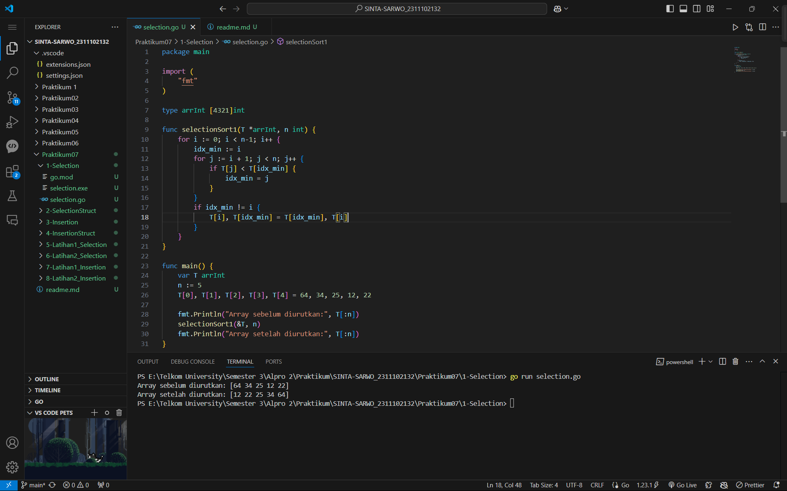
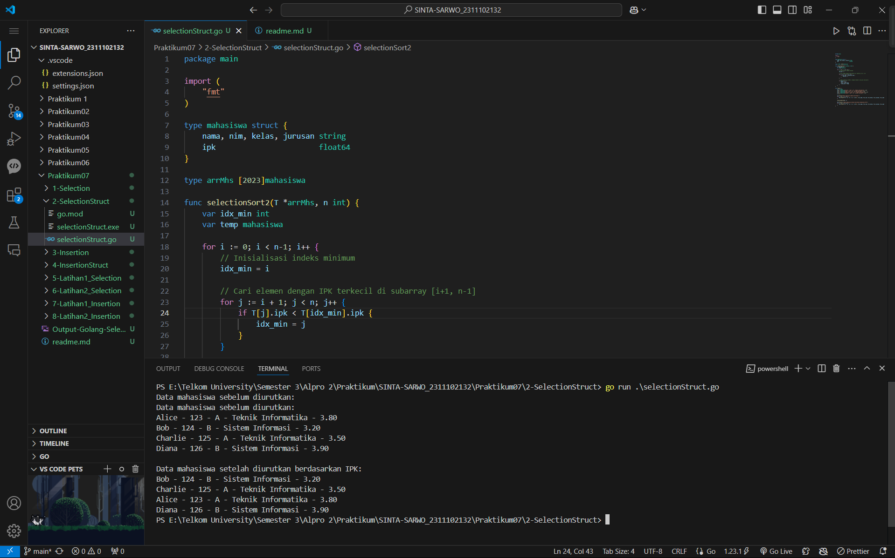
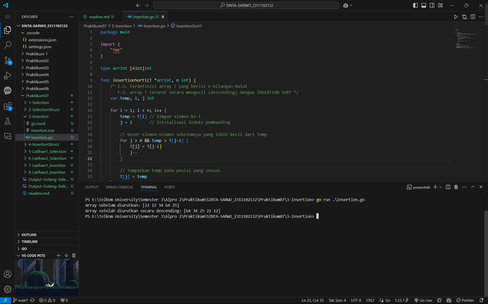
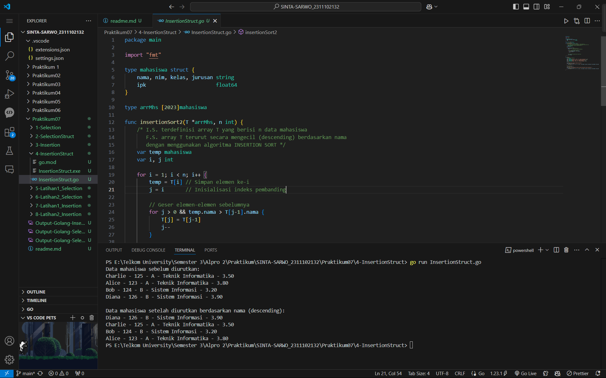
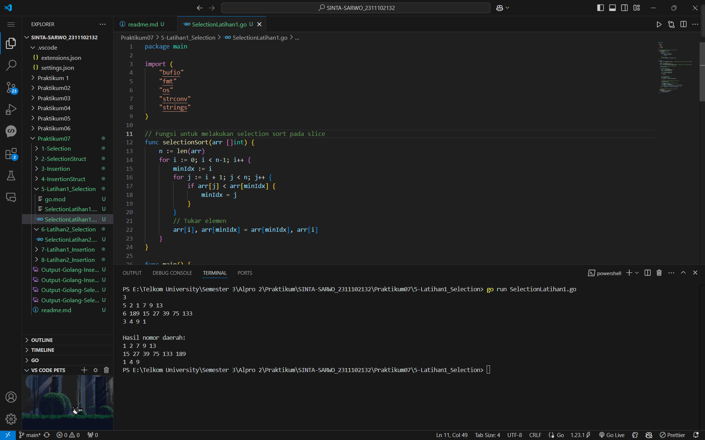
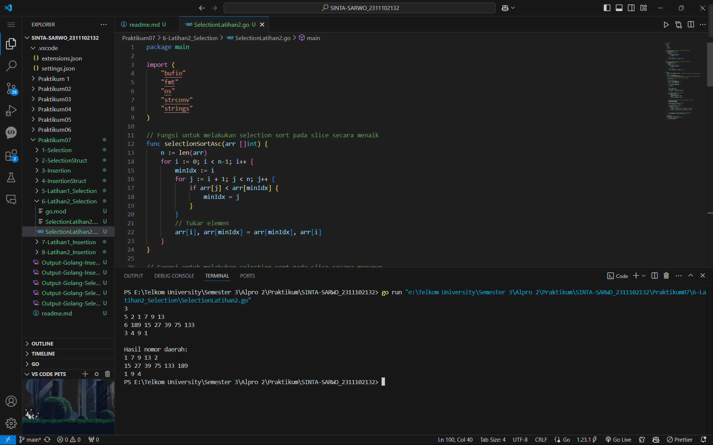
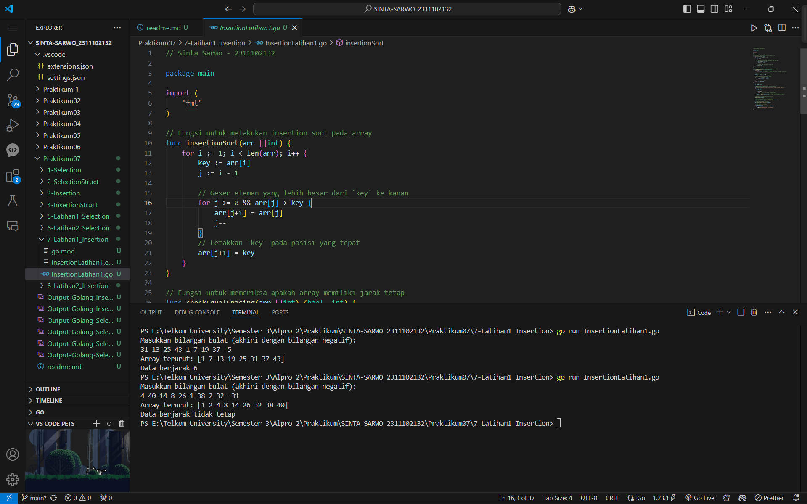
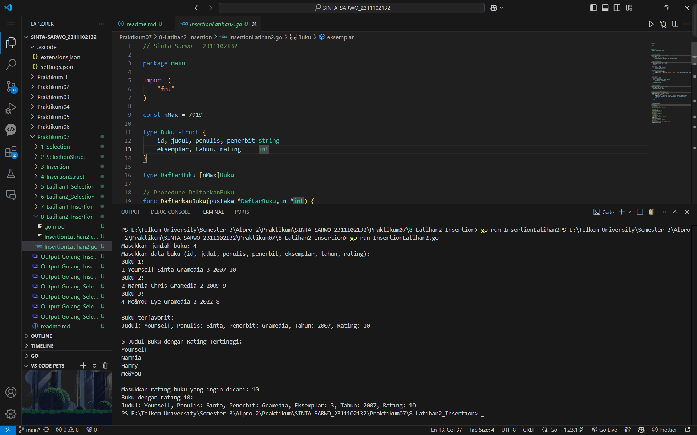

# <h1 align="center">Praktikum 7 Go - Modul 12 Sorting</h1>
<p align="center">Sinta Sarwo - 2311102132</p>

## 1. Program Code - Selection Sorting

**Program Code**
```go
package main

import (
	"fmt"
)

type arrInt [4321]int

func selectionSort1(T *arrInt, n int) {
	for i := 0; i < n-1; i++ {
		idx_min := i
		for j := i + 1; j < n; j++ {
			if T[j] < T[idx_min] {
				idx_min = j
			}
		}
		if idx_min != i {
			T[i], T[idx_min] = T[idx_min], T[i]
		}
	}
}

func main() {
	var T arrInt
	n := 5
	T[0], T[1], T[2], T[3], T[4] = 64, 34, 25, 12, 22

	fmt.Println("Array sebelum diurutkan:", T[:n])
	selectionSort1(&T, n)
	fmt.Println("Array setelah diurutkan:", T[:n])
}
```

**Screenshot Output**

#### Output:


## 2. Program Code - Selection Struct

**Program Code**
```go
package main

import (
	"fmt"
)

type mahasiswa struct {
	nama, nim, kelas, jurusan string
	ipk                       float64
}

type arrMhs [2023]mahasiswa

func selectionSort2(T *arrMhs, n int) {
	var idx_min int
	var temp mahasiswa

	for i := 0; i < n-1; i++ {
		// Inisialisasi indeks minimum
		idx_min = i

		// Cari elemen dengan IPK terkecil di subarray [i+1, n-1]
		for j := i + 1; j < n; j++ {
			if T[j].ipk < T[idx_min].ipk {
				idx_min = j
			}
		}

		// Tukar elemen di indeks i dengan elemen di idx_min jika perlu
		if idx_min != i {
			temp = T[i]
			T[i] = T[idx_min]
			T[idx_min] = temp
		}
	}
}

func main() {
	var T arrMhs
	T[0] = mahasiswa{"Alice", "123", "A", "Teknik Informatika", 3.8}
	T[1] = mahasiswa{"Bob", "124", "B", "Sistem Informasi", 3.2}
	T[2] = mahasiswa{"Charlie", "125", "A", "Teknik Informatika", 3.5}
	T[3] = mahasiswa{"Diana", "126", "B", "Sistem Informasi", 3.9}
	n := 4

	fmt.Println("Data mahasiswa sebelum diurutkan:")
	for i := 0; i < n; i++ {
		fmt.Printf("%s - %s - %s - %s - %.2f\n", T[i].nama, T[i].nim, T[i].kelas, T[i].jurusan, T[i].ipk)
	}

	selectionSort2(&T, n)

	fmt.Println("\nData mahasiswa setelah diurutkan berdasarkan IPK:")
	for i := 0; i < n; i++ {
		fmt.Printf("%s - %s - %s - %s - %.2f\n", T[i].nama, T[i].nim, T[i].kelas, T[i].jurusan, T[i].ipk)
	}
}
```

**Screenshot Output**

#### Output:


## 3. Program Code - Insertion Sorting

**Program Code**
```go
package main

import (
	"fmt"
)

type arrInt [4321]int

func insertionSort1(T *arrInt, n int) {
	/* I.S. terdefinisi array T yang berisi n bilangan bulat
	   F.S. array T terurut secara mengecil (descending) dengan INSERTION SORT */
	var temp, i, j int

	for i = 1; i < n; i++ {
		temp = T[i] // Simpan elemen ke-i
		j = i       // Inisialisasi indeks pembanding

		// Geser elemen-elemen sebelumnya yang lebih kecil dari temp
		for j > 0 && temp > T[j-1] {
			T[j] = T[j-1]
			j--
		}

		// Tempatkan temp pada posisi yang sesuai
		T[j] = temp
	}
}

func main() {
	// Contoh penggunaan
	var T arrInt
	n := 5
	T[0], T[1], T[2], T[3], T[4] = 22, 12, 34, 64, 25

	fmt.Println("Array sebelum diurutkan:", T[:n])
	insertionSort1(&T, n)
	fmt.Println("Array setelah diurutkan secara descending:", T[:n])
}
```

**Screenshot Output**

#### Output:


## 4. Program Code - Insertion Sturct

**Program Code**
```go
package main

import "fmt"

type mahasiswa struct {
	nama, nim, kelas, jurusan string
	ipk                       float64
}

type arrMhs [2023]mahasiswa

func insertionSort2(T *arrMhs, n int) {
	/* I.S. terdefinisi array T yang berisi n data mahasiswa
	   F.S. array T terurut secara mengecil (descending) berdasarkan nama
	   dengan menggunakan algoritma INSERTION SORT */
	var temp mahasiswa
	var i, j int

	for i = 1; i < n; i++ {
		temp = T[i] // Simpan elemen ke-i
		j = i       // Inisialisasi indeks pembanding

		// Geser elemen-elemen sebelumnya
		for j > 0 && temp.nama > T[j-1].nama {
			T[j] = T[j-1]
			j--
		}

		// Tempatkan temp pada posisi yang sesuai
		T[j] = temp
	}
}

func main() {
	// Contoh data mahasiswa
	var T arrMhs
	T[0] = mahasiswa{"Charlie", "125", "A", "Teknik Informatika", 3.5}
	T[1] = mahasiswa{"Alice", "123", "A", "Teknik Informatika", 3.8}
	T[2] = mahasiswa{"Bob", "124", "B", "Sistem Informasi", 3.2}
	T[3] = mahasiswa{"Diana", "126", "B", "Sistem Informasi", 3.9}
	n := 4

	fmt.Println("Data mahasiswa sebelum diurutkan:")
	for i := 0; i < n; i++ {
		fmt.Printf("%s - %s - %s - %s - %.2f\n", T[i].nama, T[i].nim, T[i].kelas, T[i].jurusan, T[i].ipk)
	}

	insertionSort2(&T, n)

	fmt.Println("\nData mahasiswa setelah diurutkan berdasarkan nama (descending):")
	for i := 0; i < n; i++ {
		fmt.Printf("%s - %s - %s - %s - %.2f\n", T[i].nama, T[i].nim, T[i].kelas, T[i].jurusan, T[i].ipk)
	}
}
```

**Screenshot Output**

#### Output:


## 5. Program Code - Selection Latihan 1

**Program Code**
```go
// Sinta Sarwo - 2311102132

package main

import (
	"bufio"
	"fmt"
	"os"
	"strconv"
	"strings"
)

// Fungsi untuk melakukan selection sort pada slice
func selectionSort(arr []int) {
	n := len(arr)
	for i := 0; i < n-1; i++ {
		minIdx := i
		for j := i + 1; j < n; j++ {
			if arr[j] < arr[minIdx] {
				minIdx = j
			}
		}
		// Tukar elemen
		arr[i], arr[minIdx] = arr[minIdx], arr[i]
	}
}

func main() {
	reader := bufio.NewReader(os.Stdin) // Membuat pembaca untuk membaca input dari pengguna

	// Baca jumlah daerah
	nInput, _ := reader.ReadString('\n')
	n, _ := strconv.Atoi(strings.TrimSpace(nInput)) // Mengubah input string menjadi integer

	// Slice untuk menyimpan hasil setiap daerah
	var hasil []string

	for i := 0; i < n; i++ {
		// Baca data per daerah
		line, _ := reader.ReadString('\n')
		data := strings.Fields(line)

		// Parse jumlah rumah kerabat
		m, _ := strconv.Atoi(data[0])
		if m < 1 {
			continue
		}

		// Parse nomor rumah
		rumah := make([]int, m)
		for j := 0; j < m; j++ {
			rumah[j], _ = strconv.Atoi(data[j+1])
		}

		// Urutkan nomor rumah menggunakan selection sort
		selectionSort(rumah)

		// Gabungkan hasil daerah ini menjadi string
		var daerahHasil []string
		for _, nomor := range rumah {
			daerahHasil = append(daerahHasil, strconv.Itoa(nomor))
		}
		hasil = append(hasil, strings.Join(daerahHasil, " "))
	}

	// Cetak semua hasil setelah semua input selesai
	fmt.Println()
	fmt.Println("Hasil nomor daerah: ")
	for _, daerah := range hasil {
		fmt.Println(daerah)
	}
}
```

**Screenshot Output**

#### Output:


## 6. Program Code - Selection Latihan 2

**Program Code**
```go
// Sinta Sarwo - 2311102132

package main

import (
	"bufio"
	"fmt"
	"os"
	"strconv"
	"strings"
)

// Fungsi untuk melakukan selection sort pada slice secara menaik
func selectionSortAsc(arr []int) {
	n := len(arr)
	for i := 0; i < n-1; i++ {
		minIdx := i
		for j := i + 1; j < n; j++ {
			if arr[j] < arr[minIdx] {
				minIdx = j
			}
		}
		// Tukar elemen
		arr[i], arr[minIdx] = arr[minIdx], arr[i]
	}
}

// Fungsi untuk melakukan selection sort pada slice secara menurun
func selectionSortDesc(arr []int) {
	n := len(arr)
	for i := 0; i < n-1; i++ {
		maxIdx := i
		for j := i + 1; j < n; j++ {
			if arr[j] > arr[maxIdx] {
				maxIdx = j
			}
		}
		// Tukar elemen
		arr[i], arr[maxIdx] = arr[maxIdx], arr[i]
	}
}

func main() {
	reader := bufio.NewReader(os.Stdin) // Membuat pembaca untuk membaca input dari pengguna

	// Baca jumlah daerah
	nInput, _ := reader.ReadString('\n')
	n, _ := strconv.Atoi(strings.TrimSpace(nInput)) // Mengubah input string menjadi integer

	// Variabel untuk menyimpan hasil akhir untuk semua daerah
	var hasil []string

	for i := 0; i < n; i++ {
		// Baca data per daerah
		line, _ := reader.ReadString('\n')
		data := strings.Fields(line)

		// Parse jumlah rumah kerabat
		m, _ := strconv.Atoi(data[0])
		if m < 1 {
			continue
		}

		// Parse nomor rumah
		rumah := make([]int, m)
		for j := 0; j < m; j++ {
			rumah[j], _ = strconv.Atoi(data[j+1])
		}

		// Pisahkan nomor rumah ganjil dan genap
		var ganjil, genap []int
		for _, nomor := range rumah {
			if nomor%2 == 0 {
				genap = append(genap, nomor)
			} else {
				ganjil = append(ganjil, nomor)
			}
		}

		// Urutkan nomor rumah ganjil secara menaik dan genap secara menurun
		selectionSortAsc(ganjil)
		selectionSortDesc(genap)

		// Gabungkan nomor rumah ganjil dan genap
		result := append(ganjil, genap...)

		// Simpan hasilnya untuk dicetak nanti
		var resultStr []string
		for j, nomor := range result {
			if j > 0 {
				resultStr = append(resultStr, fmt.Sprintf(" %d", nomor))
			} else {
				resultStr = append(resultStr, fmt.Sprintf("%d", nomor))
			}
		}

		// Gabungkan hasil per daerah menjadi satu string dan simpan
		hasil = append(hasil, strings.Join(resultStr, ""))
	}

	fmt.Println()
	fmt.Println("Hasil nomor daerah: ")
	// Cetak hasil setelah semua input diproses
	for _, result := range hasil {
		fmt.Println(result)
	}
}
```

**Screenshot Output**

#### Output:


## 7. Program Code - Insertion Latihan 1

**Program Code**
```go
// Sinta Sarwo - 2311102132

package main

import (
	"fmt"
)

// Fungsi untuk melakukan insertion sort pada array
func insertionSort(arr []int) {
	for i := 1; i < len(arr); i++ {
		key := arr[i]
		j := i - 1

		// Geser elemen yang lebih besar dari `key` ke kanan
		for j >= 0 && arr[j] > key {
			arr[j+1] = arr[j]
			j--
		}
		// Letakkan `key` pada posisi yang tepat
		arr[j+1] = key
	}
}

// Fungsi untuk memeriksa apakah array memiliki jarak tetap
func checkEqualSpacing(arr []int) (bool, int) {
	if len(arr) < 2 {
		return true, 0 // Jika hanya 1 elemen atau kosong, dianggap jarak tetap
	}

	// Hitung jarak antara dua elemen pertama
	distance := arr[1] - arr[0]

	// Periksa jarak setiap pasangan elemen
	for i := 2; i < len(arr); i++ {
		if arr[i]-arr[i-1] != distance {
			return false, 0
		}
	}
	return true, distance
}

func main() {
	var numbers []int

	// Membaca input hingga bilangan negatif ditemukan
	fmt.Println("Masukkan bilangan bulat (akhiri dengan bilangan negatif):")
	for {
		var num int
		fmt.Scan(&num)

		if num < 0 {
			break // Akhiri input jika bilangan negatif
		}
		numbers = append(numbers, num) // Simpan hanya bilangan non-negatif
	}

	// Urutkan array menggunakan insertion sort
	insertionSort(numbers)

	// Periksa apakah jarak antar elemen tetap
	isEqualSpacing, distance := checkEqualSpacing(numbers)

	// Cetak array setelah pengurutan
	fmt.Println("Array terurut:", numbers)

	// Cetak status jarak elemen
	if isEqualSpacing {
		fmt.Printf("Data berjarak %d\n", distance)
	} else {
		fmt.Println("Data berjarak tidak tetap")
	}
}
```

**Screenshot Output**

#### Output:


## 8. Program Code - Insertion Latihan 2

**Program Code**
```go
// Sinta Sarwo - 2311102132

package main

import (
	"fmt"
)

const nMax = 7919

type Buku struct {
	id, judul, penulis, penerbit string
	eksemplar, tahun, rating     int
}

type DaftarBuku [nMax]Buku

// Procedure DaftarkanBuku
func DaftarkanBuku(pustaka *DaftarBuku, n *int) {
	fmt.Println("Masukkan data buku (id, judul, penulis, penerbit, eksemplar, tahun, rating):")
	for i := 0; i < *n; i++ {
		fmt.Printf("Buku %d:\n", i+1)
		fmt.Scan(&pustaka[i].id, &pustaka[i].judul, &pustaka[i].penulis, &pustaka[i].penerbit,
			&pustaka[i].eksemplar, &pustaka[i].tahun, &pustaka[i].rating)
	}
}

// Procedure CetakTerfavorit
func CetakTerfavorit(pustaka DaftarBuku, n int) {
	if n == 0 {
		fmt.Println("Tidak ada buku di pustaka.")
		return
	}
	maxRating := pustaka[0].rating
	for i := 1; i < n; i++ {
		if pustaka[i].rating > maxRating {
			maxRating = pustaka[i].rating
		}
	}
	fmt.Println("Buku terfavorit: ")
	for i := 0; i < n; i++ {
		if pustaka[i].rating == maxRating {
			fmt.Printf("Judul: %s, Penulis: %s, Penerbit: %s, Tahun: %d, Rating: %d\n", pustaka[i].judul, pustaka[i].penulis, pustaka[i].penerbit, pustaka[i].tahun, pustaka[i].rating)
		}
	}
}

// Procedure UrutBuku
func UrutBuku(pustaka *DaftarBuku, n int) {
	for i := 1; i < n; i++ {
		key := (*pustaka)[i]
		j := i - 1
		for j >= 0 && (*pustaka)[j].rating < key.rating {
			(*pustaka)[j+1] = (*pustaka)[j]
			j--
		}
		(*pustaka)[j+1] = key
	}
}

// Procedure Cetak5Terbaru
func Cetak5Terbaru(pustaka DaftarBuku, n int) {
	fmt.Println("5 Judul Buku dengan Rating Tertinggi:")
	for i := 0; i < n && i < 5; i++ {
		fmt.Println(pustaka[i].judul)
	}
}

// Procedure CariBuku (menggunakan pencarian biner)
func CariBuku(pustaka DaftarBuku, rating int) {
	found := false
	fmt.Printf("Buku dengan rating %d:\n", rating)
	for _, buku := range pustaka {
		if buku.rating == rating {
			fmt.Printf("Judul: %s, Penulis: %s, Penerbit: %s, Eksemplar: %d, Tahun: %d, Rating: %d\n",
				buku.judul, buku.penulis, buku.penerbit, buku.eksemplar, buku.tahun, buku.rating)
			found = true
		}
	}
	if !found {
		fmt.Println("Tidak ada buku dengan rating tersebut.")
	}
}

func main() {
	var pustaka DaftarBuku
	var n int
	var rating int

	// Masukkan jumlah buku
	fmt.Print("Masukkan jumlah buku: ")
	fmt.Scan(&n)

	// Daftarkan buku
	DaftarkanBuku(&pustaka, &n)

	// Cetak buku terfavorit
	fmt.Println()
	CetakTerfavorit(pustaka, n)

	// Urutkan buku
	UrutBuku(&pustaka, n)

	// Cetak 5 buku dengan rating tertinggi
	fmt.Println()
	Cetak5Terbaru(pustaka, n)

	// Cari buku dengan rating tertentu
	fmt.Println()
	fmt.Print("Masukkan rating buku yang ingin dicari: ")
	fmt.Scan(&rating)
	CariBuku(pustaka, rating)
}
```

**Screenshot Output**

#### Output:
